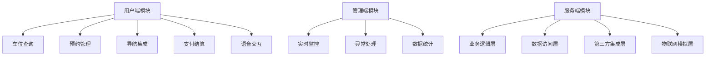

# 智能停车场项目开发上下文文档
## 项目元信息
- **项目名称**: 智能停车场预约微信小程序
- **项目阶段**: 基础开发阶段
- **开发环境**: TREA
- **创建时间**: 2025-10-15
- **关联文件**:
  - 智能停车场小程序落地指南.md
  - 小程序项目初始化指南.md
  - 软件使用说明final.md

## 1. 项目概述
### 1.1 核心目标
构建"预约-导航-入场-占位-离场-结算"闭环系统，通过微信小程序实现:
- 用户端: 车位查询/预约/导航/支付一体化服务
- 管理端: 实时监控/异常处理/数据统计功能
- 技术目标: 支持200车位并发预约，端到端响应时间<800ms

### 1.2 关键指标
| 指标类别 | 具体参数 | 基准值 |
|---------|---------|-------|
| 性能指标 | p95响应时间 | <800ms |
|  | 并发用户数 | 支持500同时在线 |
|  | 预约成功率 | >99% |
| 安全指标 | 数据加密 | TLS 1.2+传输加密 |
|  | 敏感信息处理 | 车牌/手机号脱敏存储 |
| 可用性指标 | 系统可用性 | 99.9% |
|  | 降级策略覆盖率 | 100%核心服务 |

## 2. 系统架构
### 2.1 模块划分


### 2.2 技术栈详情
| 模块 | 技术选型 | 版本要求 | 配置说明 |
|-----|---------|---------|---------|
| 前端框架 | 微信原生小程序 | 基础库2.24.0+ | app.json配置见初始化指南 |
| UI组件库 | Vant Weapp | 1.10.32 | 已通过npm集成 |
| 后端框架 | Spring Boot | 2.7.x | 需配置事务管理器 |
| 数据库 | MySQL | 8.0 | 表结构见落地指南3.3节 |
| 缓存 | Redis | 6.2.x | 用于车位状态缓存 |
| 第三方地图 | 高德地图SDK | 1.4.15 | key: [待配置] |
| 语音识别 | 科大讯飞API | v1.0 | appid: [待配置] |
| 支付接口 | 微信支付V3 | 最新版 | 商户号: [待配置] |

## 3. 开发流程规范
### 3.1 迭代阶段划分
| 阶段 | 起止时间 | 核心任务 | 交付物 |
|-----|---------|---------|-------|
| 基础搭建 | 第1-2周 | 环境配置/项目初始化 | 初始化文档/代码库 |
| 核心开发 | 第3-6周 | 前后端功能开发 | 功能模块代码/接口文档 |
| 集成测试 | 第7-8周 | 系统联调/性能优化 | 测试报告/优化方案 |
| 部署上线 | 第9周 | 生产环境部署 | 部署文档/运维手册 |

### 3.2 代码管理规范
- **分支策略**: 
  - `main`: 生产环境分支
  - `develop`: 开发主分支
  - `feature/*`: 功能分支
  - `fix/*`: 修复分支
- **提交规范**: 
  - 格式: `类型(模块): 描述`
  - 类型: feat/fix/docs/style/refactor/test/chore
- **代码审查**: 
  - 至少1名团队成员Code Review通过
  - 自动化测试通过率100%

## 4. 关键数据模型
### 4.1 核心数据表结构
| 表名 | 主键 | 核心字段 | 索引设计 |
|-----|-----|---------|---------|
| parking_lot | id | name, address, total_spaces | idx_address(地址索引) |
| parking_space | id | lot_id, location_x, location_y, status | idx_lot_status(停车场+状态索引) |
| reservation | id | user_id, space_id, start_time, end_time, status | idx_user_time(用户+时间索引) |
| user | id | openid, phone, plate | uk_openid(唯一索引) |

### 4.2 API接口规范
- **基础路径**: `/api/v1`
- **请求方法**: 
  - GET: 查询资源
  - POST: 创建资源
  - PUT: 更新资源
  - DELETE: 删除资源
- **响应格式**:
```json
{
  "code": 200,
  "message": "success",
  "data": {},
  "timestamp": 1622505600000
}
```

## 5. 第三方服务配置
### 5.1 高德地图集成
```javascript
// 初始化代码示例
const amapFile = require('../../libs/amap-wx.130.js');
const myAmapFun = new amapFile.AMapWX({
  key: '您的高德地图key'
});
```

### 5.2 微信支付配置
```java
// 后端配置示例
wx:
  pay:
    app-id: wx1234567890abcdef
    mch-id: 1234567890
    mch-key: your_mch_key
    notify-url: https://api.example.com/pay/notify
```

## 6. 开发注意事项
### 6.1 性能优化要点
- **前端优化**:
  - 图片懒加载
  - 页面预加载
  - 避免setData大数据传递
- **后端优化**:
  - 接口限流(QPS=100)
  - 热点数据缓存(Redis TTL=5min)
  - 异步处理非核心流程

### 6.2 安全合规要求
- 敏感信息脱敏:
  - 手机号: 138****5678
  - 车牌: 粤A****5
- 接口安全:
  - 所有接口需token验证
  - 支付接口需签名验证
- 数据备份:
  - 数据库每日全量备份
  - 备份文件保留30天

### 6.3 异常处理机制
| 异常类型 | 处理策略 | 重试机制 | 告警级别 |
|---------|---------|---------|---------|
| 第三方API超时 | 降级使用本地缓存 | 3次(间隔1s) | 警告 |
| 数据库连接失败 | 切换备用库 | 立即重试 | 严重 |
| 预约冲突 | 返回可用车位建议 | 不重试 | 普通 |

## 7. 测试策略
### 7.1 测试类型覆盖
- 单元测试: 服务层方法覆盖率>80%
- 接口测试: 所有API通过Postman自动化测试
- 性能测试: JMeter模拟200并发用户
- 安全测试: 进行SQL注入/XSS防护测试

### 7.2 关键测试用例
```markdown
TC-001: 高峰期并发预约同一车位
- 前置条件: 车位ID=1001状态为空闲
- 操作步骤: 5个用户同时预约该车位
- 预期结果: 1人成功，4人返回冲突提示
- 优先级: 高
```

## 8. 项目资源索引
### 8.1 文档资源
- [1] 智能停车场小程序落地指南.md
- [2] 小程序项目初始化指南.md
- [3] 软件使用说明final.md

### 8.2 接口文档
- 后端API: http://localhost:8080/swagger-ui.html
- 第三方API文档:
  - 高德地图: https://lbs.amap.com/api/wx/doc
  - 微信支付: https://pay.weixin.qq.com/wiki/doc/apiv3

### 8.3 开发工具配置
- TREA环境变量配置:
  - JAVA_HOME: /usr/lib/jvm/java-11-openjdk
  - MAVEN_HOME: /opt/maven
  - NODE_HOME: /usr/local/node