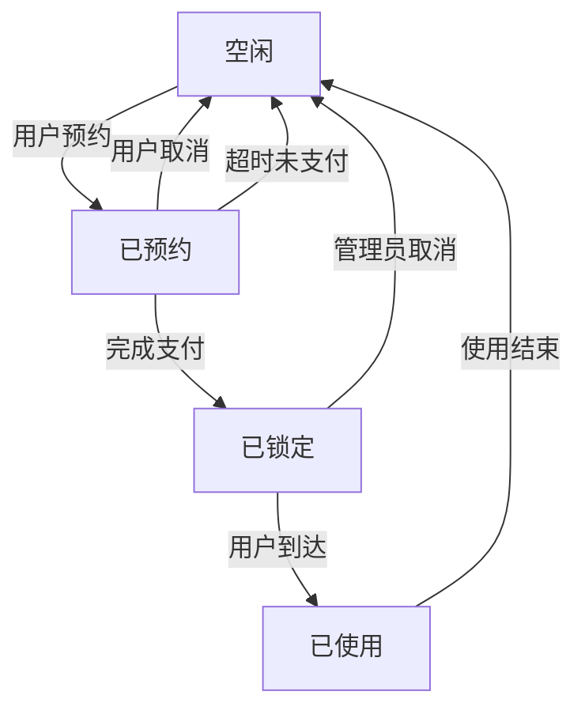

# 核心功能开发指南

## 一、开发阶段规划

### 1.1 优先级排序
| 模块名称 | 优先级 | 预计工时 | 依赖模块 |
|----------|--------|----------|----------|
| 用户认证 | P0 | 2天 | 基础框架 |
| 车位查询 | P0 | 3天 | 用户认证 |
| 预约管理 | P1 | 4天 | 车位查询 |
| 支付集成 | P1 | 3天 | 预约管理 |
| 导航服务 | P2 | 2天 | 预约管理 |
| 后台管理 | P2 | 5天 | 用户认证 |

### 1.2 迭代计划
- **迭代1**（5天）：完成用户认证、车位查询基础功能
- **迭代2**（7天）：完成预约管理、支付集成核心流程
- **迭代3**（5天）：完成导航服务、后台管理功能

## 二、用户认证模块开发

### 2.1 接口设计
| 接口路径 | 方法 | 请求参数 | 返回值 | 权限要求 |
|----------|------|----------|--------|----------|
| `/api/v1/auth/login` | POST | `{code: string}` | `{token: string, userInfo: object}` | 匿名 |
| `/api/v1/auth/userInfo` | GET | - | `{userId: number, nickname: string, avatar: string}` | 已认证 |
| `/api/v1/auth/logout` | POST | - | `{success: boolean}` | 已认证 |

### 2.2 实现要点
#### 2.2.1 微信授权流程
```javascript
// 前端调用示例
wx.login({
  success: res => {
    if (res.code) {
      wx.request({
        url: `${baseUrl}/api/v1/auth/login`,
        method: 'POST',
        data: { code: res.code },
        success: res => {
          wx.setStorageSync('token', res.data.token)
        }
      })
    }
  }
})
```

#### 2.2.2 后端验证逻辑
```java
@Service
public class AuthServiceImpl implements AuthService {
    @Override
    public LoginDTO wechatLogin(String code) {
        // 1. 调用微信接口获取openid
        String openid = wechatApi.getOpenid(code);
        if (StringUtils.isEmpty(openid)) {
            throw new BusinessException(ErrorEnum.WECHAT_AUTH_FAILED);
        }
        
        // 2. 查询或创建用户
        UserEntity user = userMapper.selectByOpenid(openid);
        if (user == null) {
            user = createNewUser(openid);
        }
        
        // 3. 生成JWT令牌
        String token = jwtUtil.generateToken(user.getId());
        return new LoginDTO(token, convertUserVO(user));
    }
}
```

### 2.3 测试用例
| 测试场景 | 输入 | 预期输出 | 优先级 |
|----------|------|----------|--------|
| 有效code登录 | 正确的微信code | 返回token和用户信息 | 高 |
| 无效code登录 | 伪造的code | 返回401错误 | 中 |
| token过期访问 | 过期token | 返回403错误 | 中 |

## 三、车位查询模块开发

### 3.1 核心数据模型
```java
// 车位实体类
@Data
public class ParkingSpaceEntity {
    private Long id;
    private String code; // 车位编号
    private Integer status; // 0-空闲 1-已预约 2-已占用
    private BigDecimal latitude; // 纬度
    private BigDecimal longitude; // 经度
    private Integer type; // 0-普通车位 1-充电桩车位 2-大型车位
    private LocalDateTime updateTime; // 状态更新时间
}
```

### 3.2 接口设计
| 接口路径 | 方法 | 请求参数 | 返回值 | 缓存策略 |
|----------|------|----------|--------|----------|
| `/api/v1/spaces` | GET | `{areaId: number, type: number, status: number}` | 车位列表 | 5分钟 |
| `/api/v1/spaces/{id}` | GET | - | 车位详情 | 10分钟 |
| `/api/v1/spaces/nearby` | GET | `{lat: number, lng: number, radius: number}` | 附近车位 | 无 |

### 3.3 实现要点
#### 3.3.1 附近车位查询算法
```java
@Override
public PageInfo<SpaceVO> getNearbySpaces(BigDecimal lat, BigDecimal lng, Integer radius, PageParam page) {
    // 1. 计算经纬度范围（简化示例）
    double latRange = radius / 111000.0; // 1纬度约等于111km
    double lngRange = radius / (111000.0 * Math.cos(Math.toRadians(lat.doubleValue())));
    
    BigDecimal minLat = lat.subtract(new BigDecimal(latRange));
    BigDecimal maxLat = lat.add(new BigDecimal(latRange));
    BigDecimal minLng = lng.subtract(new BigDecimal(lngRange));
    BigDecimal maxLng = lng.add(new BigDecimal(lngRange));
    
    // 2. 查询范围内车位
    List<SpaceEntity> entities = spaceMapper.selectByLocationRange(minLat, maxLat, minLng, maxLng, page);
    
    // 3. 计算距离并排序
    List<SpaceVO> result = entities.stream()
        .map(entity -> {
            SpaceVO vo = convertVO(entity);
            vo.setDistance(calculateDistance(lat, lng, entity.getLatitude(), entity.getLongitude()));
            return vo;
        })
        .sorted(Comparator.comparingDouble(SpaceVO::getDistance))
        .collect(Collectors.toList());
        
    return new PageInfo<>(result);
}
```

### 3.4 前端组件设计
```vue
<template>
  <view class="space-list">
    <scroll-view scroll-y>
      <view class="space-item" v-for="item in spaceList" :key="item.id">
        <view class="space-info">
          <text class="space-code">车位号: {{item.code}}</text>
          <text class="space-type">{{typeMap[item.type]}}</text>
        </view>
        <view class="space-status">
          <text :class="statusClass[item.status]">{{statusMap[item.status]}}</text>
        </view>
        <view class="space-distance">
          距离: {{item.distance.toFixed(1)}}米
        </view>
        <button @click="navigateToDetail(item.id)">查看详情</button>
      </view>
    </scroll-view>
  </view>
</template>
```

## 四、预约管理模块开发

### 4.1 状态流转图


### 4.2 核心接口
| 接口路径 | 方法 | 请求参数 | 返回值 | 事务要求 |
|----------|------|----------|--------|----------|
| `/api/v1/reservations` | POST | `{spaceId: number, startTime: string, endTime: string}` | 预约订单 | 是 |
| `/api/v1/reservations/{id}` | GET | - | 预约详情 | 否 |
| `/api/v1/reservations/{id}/cancel` | PUT | - | 操作结果 | 是 |
| `/api/v1/reservations/current` | GET | - | 当前预约 | 否 |

### 4.3 并发控制实现
```java
@Transactional
public ReservationDTO createReservation(ReservationCreateDTO dto, Long userId) {
    // 1. 检查车位状态
    ParkingSpaceEntity space = spaceMapper.selectById(dto.getSpaceId());
    if (space == null || space.getStatus() != SpaceStatus.FREE.getValue()) {
        throw new BusinessException(ErrorEnum.SPACE_NOT_AVAILABLE);
    }
    
    // 2. 悲观锁锁定车位
    int rows = spaceMapper.updateStatusWithLock(
        dto.getSpaceId(), 
        SpaceStatus.FREE.getValue(), 
        SpaceStatus.RESERVED.getValue()
    );
    if (rows == 0) {
        throw new BusinessException(ErrorEnum.SPACE_CONFLICT);
    }
    
    // 3. 创建预约记录
    ReservationEntity reservation = new ReservationEntity();
    reservation.setUserId(userId);
    reservation.setSpaceId(dto.getSpaceId());
    reservation.setStartTime(LocalDateTime.parse(dto.getStartTime()));
    reservation.setEndTime(LocalDateTime.parse(dto.getEndTime()));
    reservation.setStatus(ReservationStatus.PENDING.getValue());
    reservation.setOrderNo(generateOrderNo());
    
    reservationMapper.insert(reservation);
    
    // 4. 发送预约通知
    notificationService.sendReservationNotice(reservation);
    
    return convertDTO(reservation);
}
```

## 五、支付集成模块开发

### 5.1 支付流程设计
```
用户发起支付 → 创建支付订单 → 调用支付接口 → 支付结果回调 → 更新订单状态 → 发送通知
```

### 5.2 接口定义
| 接口路径 | 方法 | 请求参数 | 返回值 | 备注 |
|----------|------|----------|--------|------|
| `/api/v1/pay/create` | POST | `{reservationId: number, payType: number}` | 支付参数 |  |
| `/api/v1/pay/callback` | POST | 支付平台参数 | 支付平台要求格式 | 回调接口 |
| `/api/v1/pay/query` | GET | `{reservationId: number}` | 支付状态 |  |

### 5.3 安全实现
```java
@PostMapping("/callback")
public String payCallback(HttpServletRequest request) {
    // 1. 验证签名
    boolean verifyResult = payService.verifySign(request);
    if (!verifyResult) {
        log.warn("支付回调签名验证失败");
        return "fail";
    }
    
    // 2. 解析参数
    PayCallbackDTO callbackDTO = payService.parseCallback(request);
    
    // 3. 处理业务逻辑（使用分布式锁防止重复处理）
    String lockKey = "pay:" + callbackDTO.getOutTradeNo();
    try (RedisLock lock = redisLock.lock(lockKey, 30000)) {
        if (lock == null) {
            log.warn("获取分布式锁失败: {}", lockKey);
            return "fail";
        }
        
        // 4. 更新订单状态
        payService.processPaymentResult(callbackDTO);
    }
    
    return "success";
}
```

## 六、开发规范与检查项

### 6.1 代码规范检查清单
- [ ] 所有接口参数使用DTO接收并添加验证注解
- [ ] 业务异常统一使用`BusinessException`并指定错误码
- [ ] 数据库操作使用MyBatis-Plus且开启分页插件
- [ ] 前端组件遵循单一职责原则，代码量不超过500行
- [ ] API返回格式统一使用`ResultDTO`包装

### 6.2 安全检查项
- [ ] 用户敏感信息传输前进行加密
- [ ] 支付相关接口添加防重放攻击措施
- [ ] 所有表单提交使用CSRF令牌验证
- [ ] 涉及金额计算使用BigDecimal类型
- [ ] 后台管理接口添加IP白名单限制

### 6.3 性能检查项
- [ ] 列表接口添加分页和排序功能
- [ ] 高频访问接口添加缓存注解
- [ ] 数据库查询添加合理索引
- [ ] 避免N+1查询问题
- [ ] 前端图片资源使用懒加载